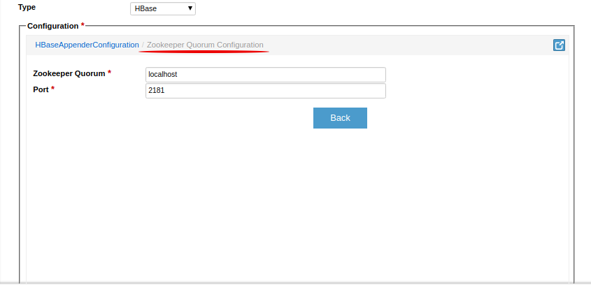

* TOC
{:toc}

The HBase log appender is used to transfer logs from the [Operations service]({{root_url}}Glossary/#operations-service) to the [HBase](https://hbase.apache.org/) database. This log appender was developed under HBase version 0.98.6.

## Create HBase Log Appender

To create an HBase log appender for your application using the [Administration UI]({{root_url}}Glossary/#administration-ui):

1. Log in to the **Administration UI** page as a [tenant developer]({{root_url}}Glossary/#tenant-developer).

2. Click **Applications** and open the **Log appenders** page of your application.
Click **Add log appender**.

3. On the **Log appender details** page, enter the necessary information and set the **Type** field to **HBase**.

	

>**NOTE:** The field "Log metadata" is not currently working.
{:.note}

4. Fill in the **Configuration** section for your log appender and click **Add**.
See [Configure log appender](#configure-log-appender).

	
	
	

## Configure log appender


The HBase log appender configuration must match [this Avro schema](/server/appenders/hbase-appender/src/main/avro/HBaseAppenderConfiguration.avsc).

You can configure the following log appender settings:

* **Zookeeper Quorum** -- list of Zookeeper hosts responsible for HBase cluster connection. For more than one host, use commas to separate the hosts. 
* **Keyspace name** -- HBase namespace used to prefix the data table. The namespace can be previously set in HBase. If it is not, the log appender will create it.
* **Table name** -- HBase table name.
* **Column families** -- specify and configure column families for the HBase table.
* **Column mapping** -- mapping of specific log data to appropriate columns. Use the checkboxes to make any field part of the row key.


## Playing with HBase log appender
The example below uses the data collection demo from [My First Kaa Application](/doc/Programming-guide/Your-first-Kaa-application/index.md). However, it extends the number of fields in the log schema. The log appender will send data to Kaa and then persist it to HBase. Some selection queries will be demonstrated using the persisted data.

Below is the log schema for the application.

```json
{
    "type":"record",
    "name":"Data",
    "namespace":"org.kaaproject.kaa.scheme.sample",
    "fields":[
        {
            "name":"id",
            "type":"String"
        },    	
        {
            "name":"temperature",
            "type":"int"
        },
        {
            "name":"timestamp",
            "type":"long"
        },
        {
            "name":"location",
            "type":"String"
        }
    ],
    "displayName":"Logging scheme"
}
```
To play around with the HBase log appender:

1. Follow the application instructions from [My First Kaa Application](/doc/Programming-guide/Your-first-Kaa-application/index.md) and use the log schema described above.

2. Log in to the **Administration UI** as a tenant developer, open the **Log appenders** page of **My First Kaa Application** and click **Add log appender**.

3. Follow the HBase log appender configuration settings presented on the figures from [Create HBase Log Appender](#create-hbase-log-appender).

4. Run the application as described in [My First Kaa Application](/doc/Programming-guide/Your-first-Kaa-application/index.md).

5. The console will display the following messages.

		My First Kaa Application started
		Default sample period: 1
		Sampled temperature: 28
		Sampled temperature: 31 
		Sampled temperature: 32 
		Sampled temperature: 30 
		Sampled temperature: 28 
		...

6. To verify that your logs have been persisted to HBase, open the HBase shell from the terminal using the command below.

    ```bash
    hbase shell
    ```

    Then run

    ```bash
    scan 'kaa:myfirstapplication'
    ```
    
7. The following output will be displayed.

    ```bash
     ROW                        COLUMN+CELL
     sensorID+1523616858341	column=info:loc,	timestamp=1523616858753,	value=sensor_location
     sensorID+1523616858341	column=info:temp,	timestamp=1523616858753,	value=28
     sensorID+1523616858341	column=meta:id,		timestamp=1523616858753,	value=sensorID
     sensorID+1523616858341	column=meta:ts,		timestamp=1523616858753,	value=1523616858341
     sensorID+1523616859327	column=info:loc,	timestamp=1523616859578,	value=sensor_location
     sensorID+1523616859327	column=info:temp,	timestamp=1523616859578,	value=26
     sensorID+1523616859327	column=meta:id,		timestamp=1523616859578,	value=sensorID
     sensorID+1523616859327	column=meta:ts,		timestamp=1523616859578,	value=1523616859327
     ...
    ```
